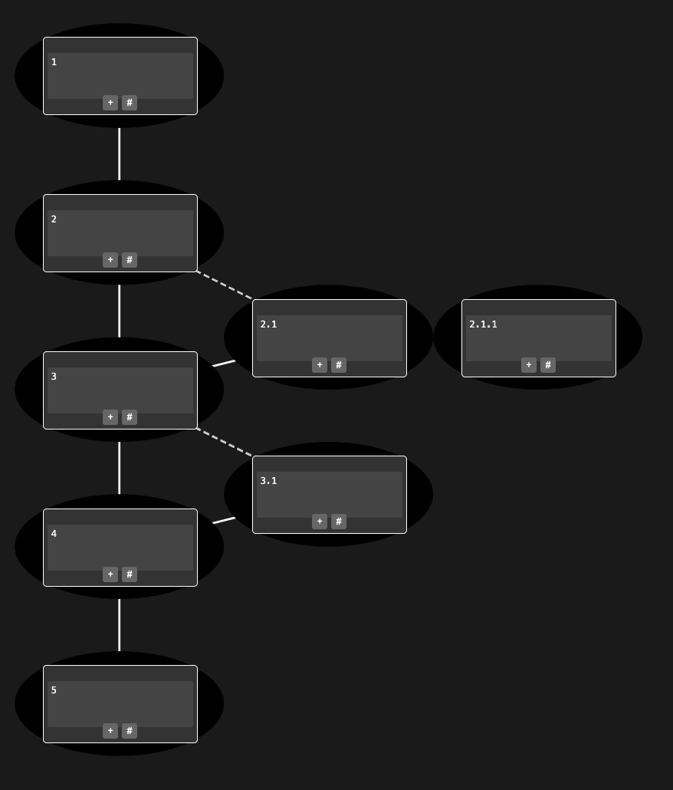

# README

# DAGGER Mini MVP 🗡️

Welcome to **DAGGER**—the Directed Acyclic Graph (DAG) interface that turns linear LLM chats into a navigable, multidimensional thought-space. Think of it as a web-browser for AI conversations, where you can branch subtopics, reconnect ideas, and manage complexity like a pro. 🌐

This is a scrappy Mini MVP, built to launch early and learn fast. It’s a top-to-bottom DAG UI with nodes and edges, powered by Cytoscape.js. We’re just getting started—LLM integration and state persistence are coming soon!

## 📸 The Futuristic UI 😉

Inspired by my 1995 graph layout project GAZER (General Algorithms for Zapping Extensive Relations—lol), DAGGER’s logo is a glowing DAG graph with a sleek dagger piercing through, illuminated by a high-tech drone flying overhead. It’s a nod to the past, but built for the future. 🛸 (Yes, it’s a bit rough around the edges—we’ll polish it later!)

## 🚀 Getting Started

### Prerequisites
- Node.js v18.20.7 (yes, I am usind an older one for compatibility issues with CotoagaDAO crypto and smart contract stuff)
- npm 10.8.1
- A browser (Safari, Chrome, etc.)

### Setup
1. Clone the repo (bash):
   git clone https://github.com/cotoaga/dagger-mvp.git
   cd dagger-mvp

2. Install dependencies (bash):
   npm install

3. Run locally (bash):
   python -m http.server 8000

4. Open http://localhost:8000 in your browser and watch the DAG magic unfold!

## 🛠️ What's Inside

- **index.html**: The main canvas for the DAG UI.
- **style.css**: Basic styling for nodes (#00FF99 for AI, #FFCC00 for user) and edges (#FFFFFF main, #CCCCCC dashed for branches).
- **app.js**: Cytoscape.js setup with a hardcoded chat graph (nodes, edges, click-to-branch).

## 🌟 Features

- Vertical DAG layout (top-to-bottom) with nodes and edges.
- Click + to continue the main topic thread, or to remerge with the main topic thread
- Click # to spawn a branch or a sub-thread.
- Dark theme (#1A1A1A background) for that futuristic vibe. 🤣

## 📅 What's Next

- Integrate LLMs for dynamic chat responses.
- Add state persistence with Node.js.
- Polish the UI and logo (I promise! You know, I' a visual guy).

## 📜 License

This project is licensed under the **Creative Commons Attribution-NonCommercial 4.0 International License (CC BY-NC 4.0)**. You're free to use, share, and adapt DAGGER for non-commercial purposes, as long as you give credit to **Kurt Cotoaga**. For details, see the file or visit <https://creativecommons.org/licenses/by-nc/4.0/>](https://creativecommons.org/licenses/by-nc/4.0/).

## 🤝 Contributing

This is an early MVP, so expect some rough edges! Try it out, break it, and let me know what you think. Open an issue or submit a PR--I'd love your feedback.

## 😜 Stay Tuned

More features are coming faster than a drone delivering your favorite sci-fi novel on a DAG-shaped hoverboard--stay tuned, graph nerds! ;-)

## 🤖 AI is so freaking cool! 😎

Finaly the nerd in me is reborn 🤓
